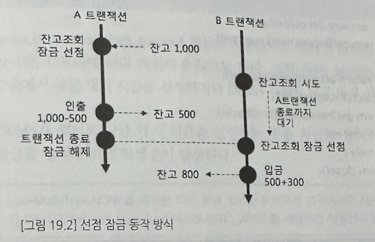
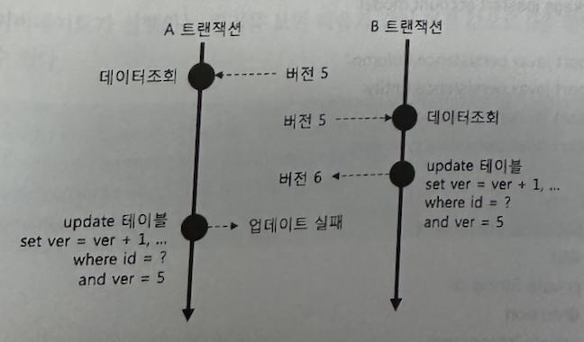

# 19. 잠금기법
## 01. 동시 접근과 잠금
동시 접근 문제를 막기 위한 가장 쉬운 방법은 DB 트랜잭션 격리 수준을 높이는 것이다. 한 번에 한 트랜잭션만 실행할 수 있게 격리 수준을 높인 경우 동시 접근 문제를 막을 수 있지만 사용자가 많은 서비스의 경우 전체 성능을 떨어뜨린다.

트랜잭션 격리 수준을 높이는 대신 동시 접근을 처리할 수 있는 다른 방법은 `잠금 기법`을 사용하는 것이다.

## 02. 선점 잠금 방식(pessimistic lock)
먼저 __데이터에 접근한__ 트랜잭션이 우선순위를 갖는 방식이다.

선점 잠금을 사용하면 서로 다른 두 트랜잭션이 동시에 동일한 데이터에 접근하여 수정하는 것을 방지할 수 있고, 동시접근으로 인한 데이터 일관성이 깨지는 것을 막아준다.

EntityManager.find() 메서드의 세 번째 인자로 `LockModeType.PESSIMISTIC_WRITE` 를 값으로 전달하면 된다.

이를 사용하면 하이버네이트는 DBMS의 잠금 쿼리를 사용해서 행 단위 잠금을 사용한다.

주의할 점은 교착상태에 빠질 수 있다는 점이다. 두 트랜잭션이 서로 다른 행에서 선점 잠금을 교차로 시도할 때 발생한다.

`선점 잠금으로 인해 트랜잭션이 교착상태에 빠지는 상황을 방지하려면 잠금 대기 시간을 힌트로 설정하면 된다.` (DBMS에 따라 지원하지 않을 수 있음)

## 03. 비선점 잠금 방식(optimistic lock) 
먼저 __데이터를 수정한__ 트랜잭션이 우선순위를 갖는 방식

비선점 잠금 방식을 사용하려면 __버전 값을 저장할 컬럼__ 이 필요하다. JPA는 엔티티 조회시 버전 값을 함께 조회한다. 그리고 엔티티의 데이터가 바뀌면 update 쿼리에서 데이터 조회 시점의 버전 값을 함께 사용하고 update 수행시 버전을 1 증가시킨다. 

* 버전 값을 저장할 컬럼 추가(숫자 or 시간 타입)
* 엔티티에 버전 컬럼과 매핑할 속성에 @Version 애노테이션 설정