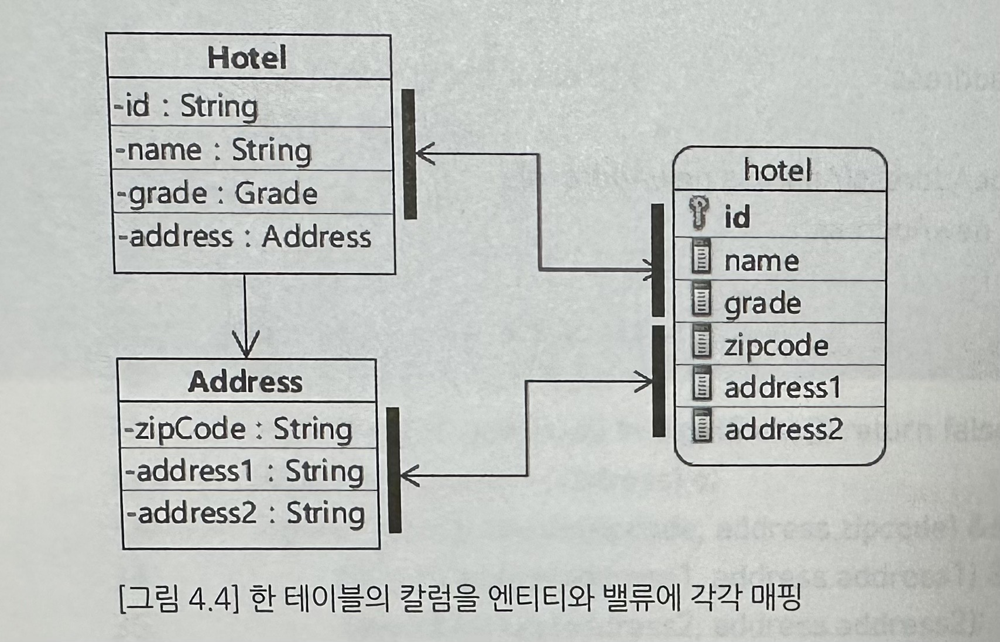

# 4. 밸류와 @Embeddable
## 01. 밸류로 의미를 더 드러내기
예) Hotel 클래스에는 호텔의 이름, 등급, 우편번호, 주소1, 주소2 데이터를 가지고 있다. 이때 Hotel 클래스에 주소 자체를 의미하는 Address 타입의 데이터를 가지게 되면 이런 타입을 밸류라고 부른다.
* 밸류는 개념적으로 한 개의 값을 표현, 예) Address 클래스는 세 개의 데이터로 구성되어 있지만, 개념적으로는 한 개의 주소를 나타낸다.
* 식별자를 갖지 않는다.
* 밸류는 자신이 속한 객체가 생성될 때 함께 생성되고 삭제될 때 함께 삭제된다.

## 02. 밸류 클래스의 구현
* 생성 시점에 모든 프로퍼티를 파라미터로 전달 받는다.(생성자)
* 읽기 전용 프로퍼티만 제공한다. (getter만)
* equals() 메서드를 재정의한다.
* hashCode() 메서드를 재정의한다.

```java
@Entity
public class Hotel {
    private Address address;
    
    ...
    
    public void changeAddress(Address newAddress) {
        this.address = newAddress;
    }
}
```

## 03. @Embeddable 애노테이션과 @Embedded 애노테이션을 이용한 밸류 매핑


Address 밸류 타입을 갖는 Hotel 엔티티를 테이블에 매핑하려면 다음과 같은 매핑 설정을 추가해야 한다.
* 밸류 타입인 Address 클래스에 `@Embeddable` 애노테이션을 적용한다.
* Hotel 클래스는 `@Embedded` 애노테이션을 사용해서 밸류 타입을 매핑 설정한다.

```java
@Embeddable
public class Address {
    private String zipcode;
    private String address1;
    private String address2;
}


@Entity
public class Hotel {
    @Id
    private String id;
    private String name;
    
    @Embedded
    private Address address;
    
    ...
}
```

1. null 밸류의 매핑 처리 : Hotel 클래스 생성시 Address 값을 받는 파라미터에 null 값을 매핑하는 경우 Address 세개의 데이터 모두 null로 매핑된다.
2. @Embeddable의 접근 타입 : 밸류 객체의 매핑 대상은 해당 엔티티의 접근 타입을 따른다. 필드 접근 타입이면 필드 접근, 프로퍼티 접근 타입이면 프로퍼티 접근 타입을 따른다. 프로퍼티 접근의 경우 Address에도 get/set 메서드를 정의해야 한다.

## 04. @Entity와 @Embeddable의 라이프사이클
@Embedded로 매핑한 객체는 엔티티와 동일한 라이프사이클을 갖는다. 엔티티를 저장, 수정, 삭제시 엔티티에 속한 @Embeddable 객체도 함께 저장, 수정, 삭제된다.

## 05. @AttributeOverrides를 이용한 매핑 설정 재정의
```java
@Entity
public class Sight {
    @Id @GeneratedValue(strategy=GenerationType.IDENTITY)
    private Long id;
    private String name;
    
    //korAddress와 engAddress를 저장하기 위한 테이블 칼럼의 이름이 같아진다. 이때 초기화 과정에서 exception 발생
    @Embedded
    private Address korAddress;
    @Embedded
    private Address engAddress;
}

@Entity
public class Sight {
    @Id @GeneratedValue(strategy=GenerationType.IDENTITY)
    private Long id;
    private String name;
    
    @Embedded
    private Address korAddress;
    
    @Embedded
    //개별 매핑 대상에 대한 설정을 재정의 한다. AttributeOverrides는 여러개의 AttributeOverride를 설정할 때 사용한다.
    @AttributeOverrides({
        @AttributeOverride(name="zipcode", column=@Column(name="eng_zipcode")),
        @AttributeOverride(name="address1", column=@Column(name="eng_addr1")),
        @AttributeOverride(name="address2", column=@Column(name="eng_addr2")),
    })
    private Address engAddress;
}

```

## 06. @Embeddable 중첩
```java
@Embeddable
public class ContactInfo {
    @Column(name="ct_phone")
    private String phone;
    @Column(name="ct_email")
    private String email;
    
    @Embedded
    @AttributeOverrides({
        @AttributeOverride(name="zipcode", column=@Column(name="ct_zip")),
        @AttributeOverride(name="address1", column=@Column(name="ct_addr1")),
        @AttributeOverride(name="address2", column=@Column(name="ct_addr2")),
    })
    private Address address; 
}

@Entity
public class City {
    @Id
    private Long id;
    
    ...
    
    @Embedded
    private ContactInfo contactInfo;
}
```

ContactInfo 클래스에서 address를 재정의하고 있다. 이 재정의를 ContactInfo를 사용하는 City 클래스에서도 할 수 있다. 
```java
@Entity
public class City {
    @Id
    private Long id;
    
    ...
    
    @Embedded
    @AttributeOverrides({
        @AttributeOverride(name="address.zipcode", column=@Column(name="city_zip")),
        @AttributeOverride(name="address.address1", column=@Column(name="city_addr1")),
        @AttributeOverride(name="address.address2", column=@Column(name="city_addr2")),
    })
    private Address address; 
}
```

## 07. 다른 테이블 밸류 저장하기
밸류 객체를 반드시 같은 테이블에 저장해야 하는 것은 아니다. 엔티티와 밸류를 서로 다른 테이블에 저장하는 예로 기본 정보와 상세 정보를 들 수 있다. 

엔티티 클래스에 @SecondaryTable로 밸류를 저장할 테이블을 지정하고 @AttributeOverride로 칼럼의 테이블 이름을 재정의 한다.
```java
@Embeddable
public class SightDetail {
    @Column(name="hours_op")
    private String hoursOfOperation;
    private String holidays;
    private String facilities;
}

@Entity
//데이터의 일부를 다른 테이블로 매핑할 때 사용한다.
@SecondaryTable(
    name="sight_detail",
    pkJoinColumns=@PrimaryKeyJoinColumn(
        name="sight_id", referencedColumnName="id"
    )
)
public class Sight {
    @Id
    private Long id;
    priave String name;
    
    ...
    
    @Embedded
    @AttributeOverrides({
        @AttributeOverride(name="hoursOfOperation", column=@Column(name="hours_op", table="sigh_detail")),
        @AttributeOverride(name="holidays", column=@Column(name="holidays", table="sigh_detail")),
        @AttributeOverride(name="facilities", column=@Column(name="facilities", table="sigh_detail")),
    })
    private SightDetail detail;
    
    ...
}

```

Sight 객체의 detail이 존재하느냐의 여부에 따라 sight_detail 테이블에 대해 실행하는 쿼리가 달라진다. Sight의 detail이 null이 아니면, sight_detail 테이블에 데이터가 존재한다는 것으로 이때 새로운 SightDetail 객체를 detail에 할당하면 update 쿼리를 이용해서 데이터 변경을 반영한다.

## 08. @Embeddable과 복합키
테이블의 주요키가 두 개 이상의 칼럼으로 구성된 복합키이고 이 복합키를 엔티티의 식별자에 매핑해애할 경우 @Embeddable 타입을 복합키에 매핑할 식별자 타입으로 사용할 수 있다. 일반 밸류 클래스와의 차이점은
* equals()와 hashCode() 메서드를 알맞게 구현해야 한다.
* Serializable 인터페이스를 상속해야 한다.