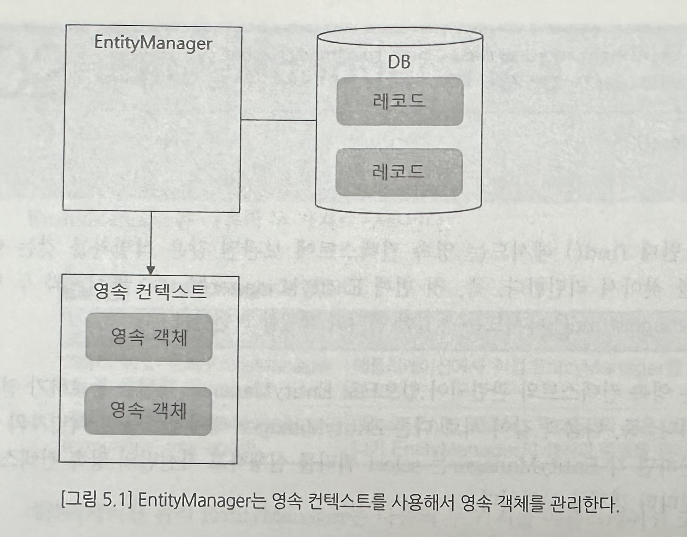

# 5. EntityManager, 영속 컨텍스트, 트랜잭션
## 01. EntityManager 와 영속 컨텍스트
EntityManager find()로 읽어온 객체는 영속 객체이다. 영속 객체는 DB에 보관된 데이터에 매핑되는 메모리상의 객체를 의미한다.

save()를 이용해 새로운 객체를 추가하면 해당 객체는 영속 객체가 되고, EntityManager가 관리한다. 그리고 트랜잭션 커밋 시점에 save()로 추가한 영속 객체를 DB에 반영한다.

영속 객체를 관리할 때 영속 컨텍스트라는 집합을 사용하는데 이 집합은 일종의 메모리 저장소로서 EntityManager가 관리할 엔티티 객체를 보관한다.

EntityManager는 트랜잭션 커밋 시점에 (or flush) 영속컨텍스트에 보관된 영속 객체의 변경 내역을 추적해서 DB에 반영한다. 데이터가 바뀐 객체는 update 쿼리를 이용해서 변경하고, 새롭게 추가된 객체는 insert 쿼리를 이용해서 삽입하고, 삭제 처리한 객체는 delete 쿼리를 이용해서 삭제한다.

### 영속 컨텍스트와 캐시
영속 컨텍스트는 엔티티타입과 식별자를 키로 사용하는 보관소이다. 동일 식별자를 갖는 엔티티에 대한 캐시 역할을 한다. 같은 트랜잭션 내에서 find()를 여러번 사용하는 경우 영속 컨텍스트에 보관된 같은 식별자를 갖는 엔티티 객체를 찾아서 리턴한다. 이 캐시는 영속 컨텍스트와 관련 있으므로 EntityManager 객체를 종료하기 전까지만 유요하다.

## 02. EntityManager 종류
* 애플리케이션 관리 EntityManager : 애플리케이션에서 직접 EntityManager를 생성하고 종료한다.
  * EntityManagerFactory 생성과 종료
  * EntityManagerFactory 를 이용해서 EntityManager를 생성하고 종료 처리
* 컨테이너 관리 EntityManager : JBoss EAP, 웹로직, TomEE와 같은 JEE 컨테이너가 EntityManager의 생성과 종료를 관리한다.
  * JEE 컨테이너에서 EntityManagerFactory와 EntityManager의 라이프사이클을 관리한다.
  * @PersistenceContext 애노테이션을 사용하여 구할 수 있다.

## 03. 트랜잭션 타입
1. 자원 로컬 트랜잭션 타입 : EntityTransaction을 이용하는 방식으로 persistence.xml 파일에 transaction-type 속성값을 `RESOURCE_LOCAL`로 지정하면 된다.
2. JTA 트랜잭션 타입 : transaction-type 속성값을 `JTA`로 지정하면 된다. JPA에서 트랜잭션을 관리하지 않고, EntityManager를 JTA 트랜잭션에 참여시켜 트랜잭션을 관리한다.

## 04. EntityManager의 영속 컨텍스트 전파
많은 애플리케이션이 로직을 수행하는 서비스와 영속성을 책임지는 리포지토리로 분리해서 구현을 한다. 보통 서비스는 트랜잭션을 관리하는 주체가 된다.

한 트랜잭션 안에서 EntityManager는 같아야 한다. EntityManager를 전파하는 가장 쉬운 방법은 메서드에 인자로 전달하는 것이다.
`User user = userRepository.find(em, user.getEmail());`

보통은 파라미터를 이용해서 EntityManager를 전파하는 방식을 사용하지 않고 파라미터 추가 없이 전파할 수 있는 방식을 사용한다.

