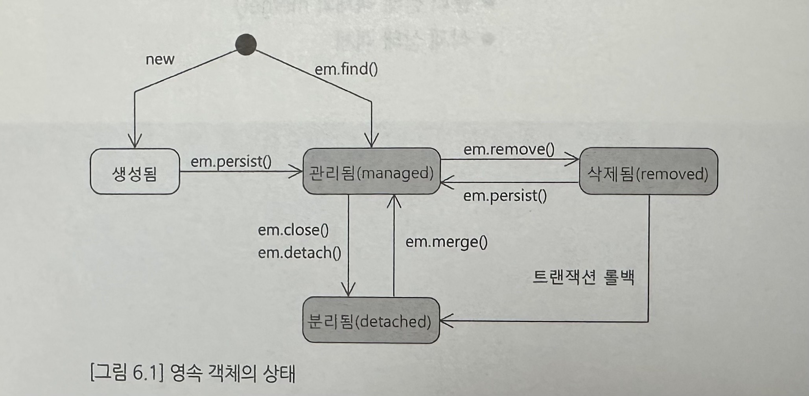

# 6. 영속 객체의 라이프사이클
## 01. 영속 객체의 라이프사이클 개요
영속 객체는 영속 컨텍스트와의 연관 상태에 따라 managed, detached, removed 상태를 갖는다. 

영속 컨텍스트에 보관된 관리됨(managed) 상태의 영속 객체를 트랜잭션 범위 안에서 변경하면 트랜잭션 커밋 시점에 변경 내역을 DB에 반영한다. EntityManager가 종료되면 영속 컨텍스트가 사라지고, 영속 객체는 영속 컨텍스트와의 연결이 끊어지고 이때 분리됨(detached) 상태가 된다. 분리됨 상태에서는 변경 내역이 추적되지 않고 필드를 변경해도 변경 내역이 DB에 반영되지 않는다.

## 02. EntityManager persist()와 관리 상태 객체
persist()를 이용해서 영속 컨텍스트에 엔티티 객체를 추가하면, 해당 엔티티 객체는 관리 상태가 된다. 영속 컨텍스트는 엔티티 객체를 관리할 때 __식별자__ 를 기준으로 각 엔티티를 구분한다. 따라서 persist()를 이용해서 엔티티 객체를 추가할 때 엔티티의 식별자 생성 방식에 따라 insert 쿼리를 실행하는 시점이 달라진다.

persist()로 저장한 객체는 관리 상태이므로 변경 내역을 추적한다. persist() 이후에 엔티티 객체의 상태를 변경하면 트랜잭션을 커밋할 때 변경 내역을 함께 DB에 반영한다. persist()로 엔티티 객체를 영속 컨텍스트에 추가하는 것은 캐시에 엔티티 객체가 보관된다는 것을 뜻한다. 

persist() -> 식별자를 이용해 find() -> persist()로 저장한 객체 리턴 `select 쿼리를 실행하지 않는다.`

## 03. EntityManager find() 와 관리 상태 객체
find()로 구한 객체도 영속 컨텍스트에 보관되어 관리 상태가 된다. 관리 상태의 영속 객체는 트랜잭션 범위에서 상태 변경시 트랜잭션 커밋 시점에 변경 내역을 반영하기 위한 update 쿼리를 실행한다.

## 04. 분리 상태 객체
영속 객체는 EntityManager가 종료되면 분리 상태가 된다. 분리 상태가 되면 객체의 상태를 변경해도 DB에 반영하지 않는다.

## 05. EntityManager merge() 로 분리 상태를 관리 상태로 바꾸기
merge()를 사용해면 분리 상태의 엔티티를 다시 관리 상태로 만들 수 있다. 

## 06. 삭제 상태 객체
remove() 메서드에 영속 객체를 전달하면 삭제 상태로 바뀐다. 그리고 트랜잭션 커밋 시점에 DELETE 쿼리를 실행한다. 