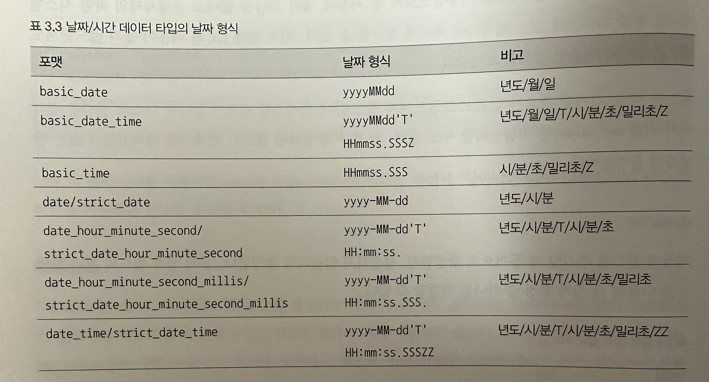
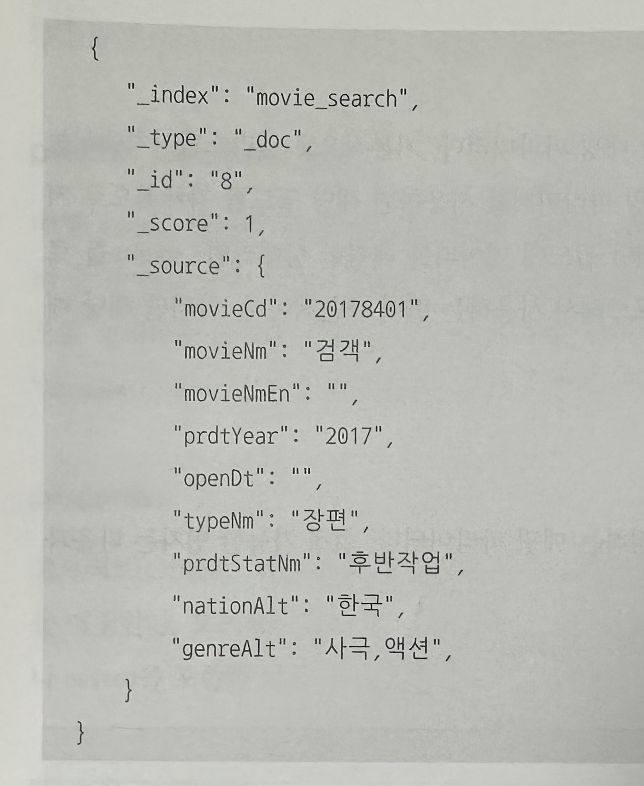

# 3. 데이터 모델링
엘라스틱서치에서 색인할 때 문서의 데이터 유형에 따라 필드에 적절한 데이터 타입을 지정해야 한다. 이러한 과정을 매핑이라고 하며, 매핑은 색인된 문서의 데이터 모델링리라고도 할 수 있다.

## 3.1 매핑 API 이해하기
문서에 존재하는 필드의 속성을 정의할 때 각 필드 속성에는 데이터 타입과 메타데이터가 포함된다. 이를 통해 색인 과정에서 문서가 어떻게 역색인으로 변환되는지를 상세하게 저장할 수 있다.

엘라스틱서치는 기본적으로 스키마리스이기 때문에 명시적으로 필드를 정의하지 않아도 데이터 유형에 따라 필드 데이터 타입에 대한 매핑 정보가 자동으로 생성된다. 한 번 생성된 매핑 타입은 변경할 수 없으므로 자동 매핑방식은 사용하지 않는 것이 안전하다.

실제 검색 대상이 되는 필드는 분석이 가능하도록 text 타입으로 정의한다.

1. 인덱스 생성 : `PUT {인덱스명}`
2. 매핑 확인 : `GET {인덱스명}/_mapping`
3. 매핑 파라미터 : 색인할 필드의 데이터를 어떻게 저장할지에 대한 다양한 옵션이 있다.
    * analyzer : 해당 필드의 데이터를 형태소 분석하겠다는 의미의 파라미터이다. text 타입의 필드는 기본적으로 사용해야 한다.
    * normalizer : term query에 분석기를 사용하기 위해 사용된다. 예) keyword 타입은 원문 그대로(소문자, 대문자 구분O) 색인되어 소문자 대문자가 달라도 서로 다른 문서로 인식된다. 이때 이 파라미터를 사용하면 같은 데이터로 인식하게 할 수 있다.
    * boost : 필드에 가중치 부여, _score 점수가 달라지기 때문에 검색 결과의 노출 순서에 영향을 준다.
    * coerce : 색인시 자동 변환을 허용할지 여부를 설정
    * copy_to : 매핑 파라미터를 추가한 필드의 값을 지정한 필드로 복사한다.
    * fielddata : 엘라스틱서치가 힙 공간에 생성하는 메모리캐시 (구버전)
    * doc_values : 엘라스틱서치가 기본으로 사용하는 캐시, text 타입을 제외한 모든 타입에서 기본으로 사용한다.
    * dynamic : 필드 추가시 동적으로 생성할지, 않을지 결정
    * enabled : 검색 결과에는 포함되지만 색인은 하고싶지 않은 경우
    * format : 엘라스틱서치는 날짜/시간을 문자열로 표시한다. 그에따른 미리 구성된 포맷을 사용할 수 있다.
    * 
    * ignore_above : 필드의 저장되는 문자열이 지정한 크기를 넘어서면 __빈 값__ 으로 색인한다.
    * ignore_malformed : 잘못된 데이터 타입을 색인하려고 하면 예외가 발생하고 전체 문서가 색인되지 않는데, 이를 방지하기 위해 이 매핑 파라미터를 사용하면 해당 필드만 무시하고 문서를 색인할 수 있게 한다.
    * index : 필드값을 색인할지를 결정
    * fields : 다중 필드를 설정할 수 있는 옵션이다.
    * norms : 문서의 _score 값 계산에 필요한 정규화 인수를 사용할지 여부를 설정
    * null_value : 색인시 문서에 필드가 없거나 필드의 값이 null이면 색인시 필드를 생성하지 않는다.
    * position_increment_gap : 배열 형태의 데이터 색인시 검색의 정확도를 높이기 위해 제공되는 옵션
    * properties : 오브젝트 타입이나 중첩 타입의 스키마를 정의할 때 사용되는 옵션
    * search_analyzer : 색인과 검색시 같은 분석기를 사용하는데 다른 분석기를 사용하고 싶은 경우 설정한다.
    * similarity : 유사도 측정 알고리즘 지정
    * store : 필드의 값을 저장해 검색 결과에 값을 포함하기 위한 매핑 파라미터
    * term_vector: 루씬에서 분석된 용어의 정보를 포함할지 여부를 결정하는 파라미터

## 3.2 메타 필드
메타 필드는 메타 데이터를 저장하는 특수 목적의 필드로 이를 이용해 검색시 문서를 다양한 형대로 제어하는 것이 가능해진다.



위 검색결과에서 _source 는 실제 문서의 정보를 담고 있고, 그외의 필드는 엘라스틱서치가 직접 생성한 메타필드다.

1. _index : 해당 문서가 속한 인덱스의 이름을 담고 있다. 검색된 문서의 인덱스 명을 알 수 있고, 해당 인덱스에 몇 개의 문서가 있는지 확인 가능
2. _type : 해당 문서가 속한 매핑의 타입 정보를 담고 있다. 인덱스 내부의 타입별로 몇 개의 문서가 있는지 확인 가능
3. _id : 문서를 식별하는 유일한 키 값
4. _uid : 특수 목적의 식별키, 내부적으로만 사용됨
5. _source : 문서의 원본 데이터 제공
6. _all : 색인에 사용된 모든 필드의 정보를 가진 메타 필드(6 버전 이상부터 deprecated)
7. _routing : 특정 문서를 특정 샤드에 저장하기 위해 사용자가 지정하는 메타 필드

## 3.3 필드 데이터 타입
1. keyword : 이 타입을 사용할 경우 별도의 분석기를 거치지 않고 `원문 그대로 색인`하기 때문에 특정 코드나 키워드등 정형화된 콘텐츠에 주로 사용한다. 형태소 분석을 하지 않아야하는 경우에도 keyword 타입을 사용한다. 다음의 경우에 이 타입을 사용해야 한다.
   * 검색시 필터링되는 항목
   * 정렬이 필요한 항목
   * 집계해야 하는 항목
2. text : 색인시 지정된 분석기가 칼럼의 데이터를 문자열 데이터로 인식하고 이를 분석한다.(기본 standard) 문장 형태의 데이터에 사용하기 적합한 타입이다. 또 전문 검색이 가능하다는 큰 특징을 갖고 있다.
3. Array : 하나의 필드에 여러개의 값을 매핑하고자 하는 경우 사용한다. 문자열, 숫자 같은 일반적인 값을 지정할 수 있고, 객체 형태로도 정의할 수 있다.(단, 모두 같은 타입으로만 구성해야 한다.)
4. Numeric
   * long
   * integer
   * short
   * byte
   * double
   * float
   * half_float
5. Date : JSON 포맷에서 문자열로 처리된다. 별도의 형식을 지정하지 않으면 기본 형식인 'yyyy-MM-ddTHH:mm:ssZ'로 지정된다. 어떤 형식을 사용해도 내부적으로 UTC 밀리초 단위로 변환해 저장한다.
6. Range : 범위가 있는 데이터 저장시 사용한다. 데이터의 시작과 끝 값만 정의하면 된다.
7. Boolean
8. Geo-Point : 위도, 경도 등 위치 정보를 담은 데이터 저장시 사용한다. 위치 기반 데이터를 색인하고 검색하는데 매우 유용하다.
9. IP : ip 주소와 같은 데이터 저장시 사용한다.
10. Object : JSON 포맷의 문서는 내부 객체를 계층적으로 포함할 수 있다. Object 타입 정의시 다른 데이터 타입처럼 특정 키워드를 이용하지 않고, 필드값으로 문서의 구조를 입력하면 된다.
11. Nested : Object 객체 배열을 독립적으로 색인하고 질의하는 형태의 데이터 타입이다.

## 3.4 엘라스틱서치 분석기
### 텍스트 분석 개요
엘라스틱서치는 텍스트를 처리하기 위해 기본적으로 분석기를 사용하기 때문에 특정 단어가 포함된 문서를 찾기위해 검색어로 찾을 단어를 입력하는 것처럼 동작하지 않는다.

엘라스틱서치는 문서를 색인하기 전에 해당 문서의 필드타입이 무엇인지 확인하고 텍스트 타입이면 분석기를 이용해 분석한다. 텍스트가 분석되면 개별 텀으로 나뉘어 형태소 형태로 분석된다. 텍스트 분석은 언어별로 조금씩 다르게 동작한다. (언어별로 분석기 제공)

### 역색인 구조
루씬의 색인은 역색인이라는 특수한 방식으로 구조화돼 있다.

* 모든 문서가 가지는 단어의 고유 단어 목록
* 해당 단어가 어떤 문서에 속해 있는지에 대한 정보
* 전체 문서에 각 단어가 몇 개 들어있는지에 대한 정보
* 하나의 문서에 단어가 몇 번씩 출현했는지에 대한 빈도

문서의 역색인을 만들기 위해 각 문서를 토큰화 하고, 토큰화된 단어에 대해 문서상의 위치와 출현 빈도 등의 정보를 체크한다. 대문자, 소문자가 동일한 데이터만 찾을 수 있기 때문에 이러한 문제를 해결하기 위해서는 텍스트 전체 데이터를 소문자로 변환한 다음 색인하는 방법이 있다. 원문 자체를 변경하는 것이 아니라 색인 파일에 들어가는 토큰만 변경되어 저장하는 것이다.

이처럼 색인할 때 특정한 규칙과 흐름에 의해 텍스트를 변경하는 과정을 분석이라고 하고, 해당 처리는 분석기라는 모듈을 조합해서 이뤄진다.

### 분석기의 구조
분석기는 다음과 같은 프로세스로 동작한다.
1. CHARACTER FILTER : 문장을 특정한 규칙에 의해 수정한다.
2. TOKENIZER FILTER : 수정한 문장을 개별 토큰으로 분리한다.
3. TOKEN FILTER : 개별 토큰을 특정한 규칙에 의해 변경한다.

분석기는 데이터의 특성에 따라 원하는 분석 결과를 미리 예상해보고 해당 결과를 얻기 위한 옵션을 적용해 설정해야 한다.

```
PUT /movie_analyzer
{
   "settings": {
      "index": {
         "number_of_shards": 5,
         "number_of_replicas": 1
      }
   },
   "analysis": {
      "analyzer": {
         "custom_movie_analyzer": { //custom_movie_analyzer 이름으로 분석기 설정
            "type": "custom",
            "char_filter": [
               "html_strip"  //전체 텍스트 문장에서 HTML 태그를 제거한다
            ],
            "tokenizer": "standard", //특수문자, 공백을 기준으로 텍스트 분할
            "filter": [
               "lowercase"  //모든 토큰을 소문자로 변환
            ]
         }
      }
   }
}
```

[분석기 사용법]
1. 분석기를 이용한 분석 : 형태소가 어떻게 분석되는지 확인할 수 있는 _analyze API를 제공한다.
2. 필드를 이용한 분석 : 인덱스 설정시 분석기를 직접 설정할 수 있다. 설정한 분석기는 매핑 설정을 통해 칼럼에 지정할 수 있다.
3. 색인과 검색시 분석기를 각각 설정 : 색인할 때 사용하는 index Analyzer, 검색할때 사용되는 Search Analyzer로 구분해서 구성할 수 있다.

[대표적인 분석기]
* Standard Analyzer :  인덱스 생성시 settings에 Analyzer를 정의하게 된다. 아무런 정의를 하지 않고, 필드의 데이터 타입이 text 타입인 경우 기본적으로 Standard를 사용한다. 이 분석기는 공백이나 특수문자를 기준으로 토큰을 분리하고 모든 문자를 소문자로 변경하는 필터를 사용한다.
* Whitespace : 이 분석기는 공백 문자열을 기준으로 토큰을 분리하는 간단한 분석기다.
* keyword : 전체 입력 문자를 하나의 키워드처럼 처리한다. (토큰화 X)

### 전처리 필터
엘라스틱서치에서 제공하는 분석기는 1)전처리 필터를 이용한 정제 후 2)토크나이저를 이용해 본격적인 토큰 분리 작업을 수행한 다음 3)생성된 토큰 리스트를 토큰 필터를 통해 재가공하는 3단계 방식으로 동작한다.

토크나이저 내부에서도 일종의 전처리가 가능해서 전처리 필터는 상대적으로 활용도가 많이 떨어진다.

* html strip char 필터 : 문장에서 HTML을 제거하는 전처리 필터다.
  * escaped_tags : 특정 태그만 삭제하게 한다, 기본 값으로 HTML 태그 전부 삭제

### 토크나이저 필터
토크나이저 필터는 분석기를 구성하는 가장 핵심 구성요소이다. 전처리 필터를 거쳐 이 필터로 문서가 넘어오면 해당 텍스트는 Tokenizer의 특성에 맞게 적절히 분해된다. 분석기에 어떤 토크나이저를 사용하느냐에 따라 분석기의 전체적인 성격이 결정된다.

* Standard 토크나이저 : 일반적으로 사용되는 토크나이저로 대부분의 기호를 만나면 토큰으로 나눈다.
* WHITESPACE TOKENIZER : 공백을 만나면 텍스트를 토큰화한다.
* Ngram 토크나이저 : Ngram은 기본적으로 한 글자씩 토큰화한다. 특정 문자를 지정할 수도 있어 이 경우 문자의 목록 중 하나를 만날 때마다 단어를 자른다.
* Edge Ngram 토크나이저 : 지정된 문자의 목록 중 하나를 만날 떄마다 시작 부분을 고정시켜 단어를 자르는 방식으로 사용하는 토크나이저이다.
* keyword 토크나이저 : 텍스트를 하나의 토큰으로 만든다.

### 토큰 필터
토큰 필터는 토크나이저에서 분리된 토큰들을 변형하거나 추가, 삭제할 때 사용하는 필터다.
토크나이저에 의해 토큰이 분리되면 분리된 토큰은 배열 형태로 토큰 필터로 전달된다. 

* Ascii Folding 토큰 필터 : 아스키 코드에 해당하지 않는 경우 문자를 아스키 요소로 변경한다.
* Lowercase 토큰 필터 : 토큰을 구성하는 전체 문자열을 소문자로 변환한다.
* Uppercase 토큰 필터 : 전체 문자열을 대문자로 변환한다.
* Stop 토큰 필터 : 불용어로 등록할 사전을 구축해서 사용하는 필터를 의미한다. (인덱스로 만들고 싶지 않거나, 검색되지 않게 하고 싶은 단어 등록)
* Stemmer 토큰 필터 : Stemming 알고리즘을 사용해 토큰을 변형하는 필터다.
* Synonym 토큰 필터 : 동의어를 처리할 수 있는 필터다.
* Trim 토큰 필터 : 앞뒤 공백을 제거하는 토큰 필터다.

### 동의어 사전
동의어는 검색 기능을 풍부하게 할 수 있게 도와주는 도구 중 하나다. 원문에 특정 단어가 존재하지 않더라도 색인 데이터를 토큰화해서 저장할 때 통의어나 유의어에 해당하는 단어를 함께 저장해서 검색이 가능해지게 하는 기술이다.

동의어를 추가하는 방식에는 크게 두 가지가 있다.
1. 동의어를 매핑 설정 정보에 미리 파라미터로 등록하는 방식
2. 특정 파일을 별도로 생성해서 관리하는 방식

운영 중 동의어를 변경하기 어렵기 때문에 실무에서는 1번째 방식은 잘 사용하지 않는다. 

실무에서 동의어들을 모아둔 파일을 칭할 때 일반적으로 동의어 사전이라는 용어를 사용한다.

* 동의어 사전 만들기 : 동의어 파일은 엘라스틱서치가 설치된 서버 아래의 `config 디렉터리에 생성`해야 한다. ex)<엘라스틱서치 설치 디렉터리>/ config/analysis/ synonym.txt
* 동의어 추가 : 단어를 쉼표로 분리해서 등록한다. ex) Elasticsearch, 엘라스틱서치 주의할 점은 앞서 동작한 토큰 필터의 종류가 무엇이고 어떤 작업을 했느냐에 따라 달라질 수 있다.
* 동의어 치환 : 동의어를 치환하면 원본 토큰이 제거되고 변경될 새로운 토큰이 추가된다. ex) Harry => 해리

동의어 사전은 실시간으로 적용되지 않기 때문에 수정된 동의어 사전을 적용하고 싶다면 인덱스를 reload 해야 한다.

동의어 사전은 색인 시점, 검색 시점에 사용될 수 있는데 색인 시점에 동의어 사전이 사용되면 사전의 내용이 변경되더라도 색인이 변경되지 않는다. 이 경우 기존 색인을 모두 삭제하고 색인을 다시 생성해야만 변경된 사전의 내용이 적용된다.

```
PUT movie_analyzer
{
   "settings": {
      "index": {
         "analysis": {
            "analyzer": {
               "synonym_analyzer": {
                  "tokenizer": "standard",
                  "filter": [
                     "Lowercase",
                     "synonym_filter"
                  ]
               }
            },
            "filter": {
               "synonym filter": {
                  "type": "synonym",
                  "ignore _case": true,
                  "synonyms _path": "analysis/synonym. txt"
               }
            }
         }
      }
   }
}
```

## 3.5 Document API 이해하기
[엘라스틱서치에서 제공하는 대표적인 Document API]
* Index : 문서 생성
* Get :  문서 조회
* Delete : 문서 삭제
* Update : 문서 수정
* Bulk : 대량의 문서를 처리
* Reindex : 문서를 복사

### 문서 파라미터
* 문서 ID 자동 생성 : 문서 생성시 기본적으로 ID가 반드시 필요하다. ID를 지정하지 않으면 엘라스틱서치가 자동으로 ID를 부여한다. (UUID 형태)
* 버전 관리 : 색인된 모든 문서는 버전 값을 가지고 있다. 문서의 변경이 일어날때마다 버전 값이 증가한다. 
* 오퍼레이션 타입 : 일반적으로 ID가 이미 존재하는 경우 Update 작업이 일어나고, ID가 없을 경우 create 작업이 일어난다. op_type 파라미터를 이용하면 Index API를 호출할 때 수행되는 작업의 유형을 강제로 지정할 수 있다.
* 타임아웃 설정 : 일반적으로 색인 요청시 대부분 즉시 처리되나 이미 색인 작업이 진행중인 동안 추가적인 색인 API가 호출될 경우 일정기간 대기하게 된다. 이때 timeout 파라미터를 설정해서 대기 시간을 조정할 수 있다.
* 인덱스 매핑 정보 자동 생성 : Index API로 문서 색인시 기존에 정의되어 있지 않은 필드의 정보가 존재할 경우 어떻게 해야 할지 결정해야 한다. 기본적으로 동적 매핑을 허용하기 때문에 새로운 필드가 생성된다.

### Index API
Index API는 문서를 특정 인덱스에 추가하는데 사용된다. 문서가 업데이트 될 때마다 버전 값이 1씩 증가한다.
```
PUT movie_dynamic/_doc/1
{
   "movied": "20173732",
   "movieNm": "fOU& ofO|",
   "movieNmEn": "Last Child",
   "typeNm": "장 편"
}
```

### GET API
GET API는 특정 문서를 인덱스에서 조회할 때 사용하는 API다. 조회하고자 하는 문서의 ID 값을 명시적으로 지정해서 사용한다. _source 항목에서 조회되는 문서의 내용을 확인할 수 있다.

```
GET movie_dynamic/_doc/1
```

한 번에 여러 가지 작업을 다양하게 수행할 수도 있다.
```
POST _bulk
{ "index" : { "_index" : "movie _dynamic", "_type" : "_doc", "_id" : "1" } }
{ "title" : "살아남은 아이" }

{ "delete" : { "_index" : "movie_dynamic", "_type" : "_doc", " id" : "2" } }

{ "index" : { "_index" : "movie_dynamic", "_type" : "_doc", "_id" : "3" } }
{ "title" : "프렌즈: 몬스터섬의비밀" }

{ "update" : {"_index" : "movie_dynamic", "_type" : "_doc", "_id" : "1", } }
{ "doc" : {"movieNmEn" : "Last Child"} }
```

### Reindex API 
Reindex API를 사용하는 일반적인 상황은 한 인덱스에서 다른 인덱스로 문서를 복사할 때다.
```
POST /_reindex
{
   "source": { //복사할 인덱스
      "index": "movie dynamic"
   },
   "dest": {  //복사될 인덱스
      "index": "movie_dynamic_new"
   }
}
```

특정 조회 결과와 일치하는 문서만 복사하고 싶은 경우 source 항목에 쿼리를 포함시켜 쿼리 결과에 일치하는 문서만 복사할 수 있다.

기본적으로 Reindex API는 1,000건 단위로 스크롤을 수행한다. size 항목을 지정해 스크롤 크기를 변경할 수 있는데 많은 양의 문서를 복사해야 하는 경우 size를 늘려서 전체적인 속도 향상을 꾀할 수 있다. 