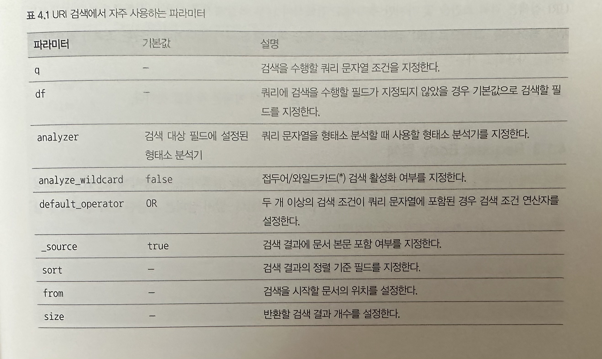

# 4. 데이터 검색
엘라스틱서치는 인덱스에 저장된 문서를 검색할 수 있도록 다양한 검색 기능을 제공한다. 특정 문장이 검색어로 요청되면 분석기를 통해 분석된 토큰의 일치 여부를 판단해서 그 결과에 점수를 매긴다. 

엘라스틱서치에서는 다양한 검색 조건을 충족시키기 위해 Query DSL이라는 특수한 쿼리 문법을 제공한다.

## 4.1 검색 API
문장은 색인 시점에 텀으로 분해된다. 검색시에는 이 텀을 일치시켜야 검색이 가능해진다.

엘라스틱서치는 색인 시점에 Analyzer를 통해 분석된 텀을 Term, 출현빈도, 문서번호와 같이 역색인 구조로 만들어 내부적으로 저장한다. 검색 시점에는 분석 가능한 데이터를 구분해서 분석이 가능할 경우 분석기를 이용해 분석을 수행한다. 이를 통해 검색 시점에도 텀을 얻을 수 있고, 해당 텀으로 역색인 구조를 이용해 문서를 찾고 이를 통해 스코어를 계산해서 결과로 제공한다.

### 검색 질의 표현 방식
엘라스틱서치에서 제공하는 검색 API는 기본적으로 질의를 기반으로 동작한다. 
* URI 검색 : HTTP GET 요청을 활용하는 방식으로 파라미터를 Key=Value 형태로 전달하는 방식이다. 파라미터로 표현할 수 있는 표현의 한계로 복잡한 질의를 작성하는 것은 불가능하다. `GET movie_search/_search?q=prdtYear:2018`
* Request Body : HTTP 요청시 Body에 검색할 칼럼과 검색어를 JSON 형태로 표현해서 전달하는 방식이다. JSON 형태의 표현을 효율적으로 하기 위해 엘라스틱서치에서는 Query DSL이라는 특별한 문법을 지원한다. 이를 이용해서 URI 방식에 비해 다양한 조합의 검색 쿼리를 작성할 수 있다.

```
POST movie_search/_search
{
    "query": {
        "term": {
            "prdtYear": "2018"
        }
    }
}
```

### URI 검색
URI 검색은 단순하고 사용하기 편리하지만 복잡한 질의문을 입력하기 힘들다는 치명적인 단점이 있다. 또한 엘라스틱서치에서 제공하는 모든 검색 옵션을 사용할 수 없다. 장점으로는 웹브라우저를 이용해 빠르게 테스트할 수 있다는 점이다.

URI 검색은 검색 조건을 몇 가지만 추가해도 검색식이 너무 복잡해져서 사용하기가 불편하고 가독성도 무척 떨어진다. 그러므로 간단한 조회가 필요할 경우에만 사용하고 가능한 한 Request Body 방식의 검색을 사용하자.



### Request Body 검색
Request Body 검색은 질의 내용을 JSON 형태로 작성하며, 이때 Query DSL이라 불리는 도메인 전용 언어 문법을 사용한다.

## 4.2 Query DSL 이해하기
Query DSL을 이용하면 여러 개의 질의를 조합하거나 질의 결과에 대해 다시 검색을 수행하는 등 기존의 URI 검색보다 강력한 검색이 가능해진다. 엘라스틱서치에서는 정밀한 검색을 위해 JSON 구조를 기반으로 한 Query DSL을 제공한다.

### Query DSL 쿼리의 구조
Query DSL로 쿼리를 작성하려면 미리 정의된 문법에 따라 JSON 구조를 작성해야 한다.

```
{
    "size":         // 리턴받는 결과의 개수 지정
    "from":         // 몇 번째 문서부터 가져올지 지정
    "timeout":      // 검색을 요청해서 결과를 받는 데 까지 걸리는 시간
    
    "_source": {}   // 검색시 필요한 필드만 출력하고 싶을 때 사용
    "query": {}     // 검색 조건문이 들어가야 하는 공간
    "aggs": {}      // 통계 및 집계 데이터를 사용할 때 사용하는 공간
    "sort": {}      // 문서 결과를 어떻게 출력할지에 대한 조건을 사용하는 공간
}
```

### Query DSL 쿼리와 필터
Query DSL을 이용해 검색 질의를 작성할 때 조금만 조건이 복잡해지더라도 여러 개의 작은 질의를 조합해서 사용해야 한다. 작은 질의는 두 가지 형태로 나눠서 생각할 수 있다.
1. 실제 분석기에 의한 전문 분석이 필요한 경우(쿼리 컨텍스트) : 전문 검색시 사용, 분석기에 의해 분석 수행, 연관성 관련 score 계산, 상대적으로 느림
2. 단순히 yes/no로 판단할 수 있는 조건 검색의 경우(필터 컨텍스트) : 조건 검색시 사용, yes/no로 단순 판별 가능, 연관성 관련 계산을 하지 않음, 상대적으로 빠름

두 가지중 어떤 방식을 사용하더라도 대부분 같은 결과를 얻을 수 있다. 하지만 내부적으로 검색 과정이나 성능이 크게 달라지기 때문에 가능한 용도를 맞춰 사용하자.

__쿼리 컨텍스트__ : 문서가 쿼리와 얼마나 유사한지 스코어로 계산한다. 질의 요청시마다 엘라스틱서치 내부의 루씬을 이용해 계산을 수행한다, 일반적으로 전문 검색에 많이 사용되고 캐싱되지 않고 디스크 연산을 수행하기 때문에 상대적으로 느리다.
```
POST movie_search/_search
{
    "query": {
        "match": {
            "movieNm": "기묘한 가족"
        }
    }
}
```

__필터 컨텍스트__ : 쿼리의 조건과 문서가 일치하는지를 구분한다. 별도로 스코어를 계산하지 않고 단순 매칭 여부를 검사한다. 자주 사용되는 결과는 내부에 캐싱한다. 기본적으로 메모리 연산을 수행하여 상대적으로 빠르다.
```
POST movie_search/_search
{
    "query": {
        "bool": {
            "must": [
                {
                    "match_all":{}
                }
            ],
            "filter": {
                "term": {
                    "repGenerNm": "다큐멘터리"
                }
            }
        }
    }
}
```

### Query DSL의 주요 파라미터
Query DSL은 다양한 파라미터를 옵션으로 제공한다.
* Multi Index 검색 : 기본적으로 모든 검색 요청은 Multi Index 및 Multi Type 검색이 가능하다. 그래서 다수의 인덱스를 검색해야 할 때도 한 번의 요청으로 검색 결과를 얻을 수 있다. `POST movie_search,movie_auto/_search` 각 인덱스가 공통적인 필드는 갖고 있지만 서로 다른 스키마 구조를 갖고 있는 경우라도 Multi Index 쿼리를 이용하면 다수의 비정형 데이터를 가지고 있는 경우에도 한번에 검색할 수 있다. 
* 쿼리 결과 페이징 : 페이징 처리를 하기 위해서는 문서의 시작을 나타내는 from 파라미터를 사용하고, 문서의 개수를 나타내기 위해 size 파라미터를 사용하면 된다. (기본값 from=0, size=5) 엘라스틱서치는 페이징된 해당 문서만 선택적으로 가져오는 것이 아닌 모든 데이터를 읽는다. 
* 쿼리 결과 정렬 : sort 파라미터를 사용하여 지정한 필드에 따라 정렬할 수 있다.
* _source 필드 필터링 : 검색 결과는 기본적으로 JSON 데이터로 제공된다. 실제 데이터는 _source 항목 아래에 존재한다. 항상 모든 필더를 볼 필요가 없을 때 필요에 따라 특정 필드를 검색 결과에서 제거하고 싶을 때도 있을 것이다. 그럴때 _source 필드를 필터링하여 원하는 필드만 조회되게 지정할 수 있다. 
* 범위 검색 : lt(<), gt(>), lte(<=), gte(>=)
* operator 설정 : 엘라스틱서치는 검색시 문장이 들어올 경우 `기본적으로 OR 연산`으로 동작한다. 실무에서는 AND 연산을 사용해야할 경우가 많다. 그럴때 operator 파라미터를 통해 연산자를 명시적으로 지정하 and 나 or 연산자를 명시적으로 지정할 수 있다.
* minimum_should_match 설정 :  or 연산을 수행하는 경우 사용할 수 있는 옵션이 있다. or 연산의 경우 검색 결과가 너무 많아질 수 있다. 이 경우 텀의 개수가 몇 개 이상 매칭될 때만 검색 결과로 나오게 할 수 있는데 그 파라미터가 minimum_should_match이다. 이 파라미터를 사용하면 or 연산으로 and 연산과 비슷한 효과를 낼 수 있다.
* fuzziness 설정 : 이 파라미터를 사용하면 단순히 같은 값을 찾는 Match Query를 `유사한 값을 찾는 Fuzzy Query로 변경`할 수 있다. 사용자가 실수로 오타를 입력한 경우 텀이 일치하지 않아 검색되지 않는다 Fuzziness 설정을 사용하면 검색이 가능해진다.
* boost 설정 : 이 설정은 검색에서 가장 많이 사용하는 파라미터중 하나다. 관련성이 높은 필드나 키워드에 가중치를 더 줄 수 있게 해준다. 

```
POST movie_search/_search
{
    "query": {
        "multi_match": {
            "query": "Fly",
            "fields": ["movieNm^3", "movieNmEn"] -- movieNm에 ^3 가중치 값으로 3을 곱하게 한다.
        }
    }
}
```

## 4.3 Query DSL의 주요 쿼리
### Match All Query
색인된 모든 문서를 검색하는 쿼리다. 

```
POST movie_search/_search
{
    "query": {
        "match_all": {}
    }
}
```

### Match Query
텍스트, 숫자, 날짜 등이 포함된 문장을 형태소 분석을 통해 텀으로 분리한 후 이 텀들을 이용해 검색 질의를 수행한다.

```
POST movie_search/_search
{
    "query": {
        "match": {
            "movieNm": "그대 장미"
        }
    }
}
```

위와 같이 질의하면 검색어에 대해 형태소 분석을 통해 "그대", "장미" 라는 2개의 텀으로 분리하여 별도의 operator가 설정되지 않았기 때문에 or 연산을 이용해 검색을 수행한다.

### Multi Match Query
Match Query와 기본적인 사용 방법은 동일하나 단일 필드가 아닌 여러 개의 필드를 대상으로 검색해야 할 때 사용하는 쿼리다.

```
POST movie_search/_search
{
    "query" : {
        "multi_match": {
            "query": "가족",
            "fields": ["movie", "movieNmEn"]
        }
    }

}
```

### Term Query
텍스트 형태의 값을 검색하기 위해 엘라스틱서치는 두 가지 매핑 유형을 지원한다. 
* Text : 필드에 저장되기 전 데이터가 분석되어 역색인 구조로 저장된다.
* Keyword : 데이터가 분석되지 않고 그래도 필드에 저장된다.

Match Query는 쿼리를 수행하기 전에 먼저 분석기를 통해 텍스트를 분석한 후 검색을 수행한다. 하지만 Term Query는 별도의 분석 작업을 수행하지 않고 입력된 텍스트가 존재하는 문서를 찾는다. 따라서 `keyword 타입을 사용하는 필드를 검색하려면 Term Query를 사용해야 한다.` 또한 검색어를 하나의 텀으로 처리하기 때문에 필드에 텀이 정확히 존재하지 않는 경우 검색이 되지 않는다.

```
POST movie_search/_search
{
    "query": {
        "term": {
            "genreAlt": "코미디"
        }
    }
}
```

### Bool Query
엘라스틱서치에서 하나의 쿼리나 여러 개의 쿼리를 조합해서 더 높은 스코어를 가진 쿼리 조건으로 검색을 수행할 수 있다. 이러한 유형의 쿼리를 Compound Query라 하고 이를 구현하기 위해 Bool Query를 제공한다.

Bool Query는 주어진 쿼리와 논리적으로 일치하는 문서를 복합적으로 검색한다.

```
{
    "query": {
        "bool": {
            "must": [],
            "must_not": [],
            "should": [],
            "filter": []
        }
    }
}
```

* must : AND =
* must_not : AND !=
* should : OR =
* filter : IN

### Query String
엘라스틱서치에는 기본적으로 내장된 쿼리 분석기가 있다. query_string 파라미터를 사용하는 쿼리를 작성하면 내장된 쿼리 분석기를 이용하는 질의를 작성할 수 있다.

```
POST movie_search/_search
{
    "query": {
        "query_string": {
            "default_field": "movieNm",
            "query": "(가정) AND (어린이 날)",  //'가정', '어린이날'이 각각 형태소 분석기를 통해 분석되며 분석된 텀을 대성으로 AND 조건과 만족하는 문서를 찾아 돌려준다.
        }
    }
}
```

### Prefix Query
해당 접두어가 있는 모든 문서를 검색하는 데 사용한다.

```
POST movie_search/_search
{
    "query": {
        "prefix": {
            "movieNm": "자전차"
        }
    }
}
```

### Exists Query
실제 값이 존재하는 문서만 찾고 싶은 경우 사용한다. 

```
POST movie_search/_search
{
    "query": {
        "exists": {
            "field": "movieNm"
        }
    }
}
```
필드값이 null이거나 문서에 필드 자체가 없는 문서를 찾고 싶다면 must_not을 이용하면 된다.

### Wildcard Query
검색어가 와일드카드와 일치하는 구문을 찾는다. 이때 형태소 분석은 이뤄지지 않는다.
* '*' : 문자의 길이와 상관없이 와일드카드와 일치하는 모든 문서를 찾는다.
* '?' : 지정된 위치의 한 글자가 다른 경우의 문서를 찾는다.

와일드카드를 사용할 경우 단어의 첫 글자로는 절대 사용해서는 안 된다.

```
POST movie_search/_search
{
    "query": {
        "wildcard": {
            "typeNm": "장?"
        }
    }
}
```

### Nested Query
Nested 데이터 타입의 필드를 검색할 때 사용한다. Nested 데이터 타입은 문서 내부에 다른 문서가 존재할 때 사용한다. path 옵션으로 중첩된 필드를 명시하고, query 옵션에 Nested 필드 검색에 사용할 쿼리를 입력한다.

## 4.4 부가적인 검색 API
### 효율적인 검색을 위한 환경설정
엘라스틱서치는 대량의 데이터를 처리하기 위해 기본적으로 데이터를 분산해서 처리한다. 

검색 요청 발생시 엘라스틱서치는 모든 샤드에 검색 요청을 브로드캐스팅해서 전달하고 기다린다. 각 샤드는 자신이 가지고 있는 데이터를 기준으로 검색을 수행하고 그 결과를 리턴한다. 그리고 모든 샤드로부터 검색 결과가 도착하면 도착한 모든 결과를 조합해서 최종 질의 결과를 출력한다.
1. 동적 분배 방식의 샤드 선택 : 부하 분산과 장애극복을 위해 원본 샤드의 데이터를 복제한 레플리카 샤드를 함께 운영하는데 검색시 모든 샤드에서 검색을 수행하게 된다면 중복된 결과를 전달하게 될 수 있다. 이러한 문제를 해결하기 위해 검색시 동일 데이터를 가지고 있는 샤드 중 하나만 선택해 검색을 수행한다. 특별히 설정하지 않는 경우 검색 요청시 적절한 분배를 위해 기본적으로 라운드 로빈 방식의 알고리즘을 사용한다. 라운드로빈 말고도 동적 분배 방식 알고리즘도 있는데 이는 검색 요청의 응답시간, 검색 요청을 수행하는 스레드 풀의 크기 등을 고려해 최적의 샤드를 종적으로 결정하는 방식이다.

```
PUT _cluster/settings
{
    "transient": {
        "cluster.routing.use_adaptive_replica_selection": true
    }
}
```

2. 글로벌 타입아웃 설정 : 검색 요청시 타임아웃을 설정하는 것은 매우 중요한 일이다. 개별 검색 요청의 경우 Request Body에 직접 타임아웃을 설정할 수 있다.

```
PUT _cluster/settings
{
    "transient": {
        "search.default_search_timeout": "1s"
    }
}
```

### Search Shards API
Search Shards API 를 이용하면 검색이 수행되는 노드 및 샤드에 대한 정보를 확인할 수 있다. 이런 정보는 질의를 최적화하거나 질의가 정상적으로 수행되지 않을 때 문제를 해결하는 데 유용하게 활용할 수 있다.

### Multi Search API
Multi Search API 는 여러 건의 검색 요청을 통합해서 한번에 요청하고 한 번에 결과를 종합해서 받을 때 사용되는 API다. 이를 사용하면 동시에 여러 개의 색인에서 검색을 수행할 수 있으므로 사용자별 맞춤 페이지 등을 구현할 때 여러 인덱스에서 사용자별로 특화된 정보를 가져오거나 할 때 유용하게 활용할 수 있다.

### Count API
본문보다는 검색된 문서의 개수가 몇 개인지 숫자만 필요한 경우 사용한다. 

```
POST movie_search/_count?q=prdYear:2017

POST movie_search/_count
{
    "query": {
        "query_string": {
            "default_field" : "prdtYear",
            "query": "2017"
        }  
    }
}
```

### Validate API
이 API를 사용하면 쿼리를 실행하기에 앞서 쿼리가 유효하게 작성됐는지 검증하는 것이 가능하다. 

```
POST movie_search/_validate/query?q=prdYear:2017

POST movie_search/_validate/query
{
    "query": {
        "match": {
            "prdtYear" : 2017
        }  
    }
}
```
쿼리가 왜 실패했는지 자세한 정보가 필요한 경우 요청 URL 파라미터로 rewrite=true 파라미터를 추가하면 된다.

### Explain API
_source를 통해 우리가 검색한 키워드와 검색 결과가 얼마나 유사한지 확인할 수 있다. 이 문서가 가진 _source 값이 어떻게 계산된 것인지 자세한 정보를 알고 싶다면 Explain API를 사용한다.

```
POST movie_search/_doc/8/_explain
{
    "query": {
        "term": {
            "prdtYear" : 2017
        }  
    }
}
```

### Profile API
이 API는 쿼리에 대한 상세한 수행 계획과 각 수행 계획별로 수행된 시간을 돌려주므로 성능을 튜닝하거나 디버깅할 때 유용하게 활용할 수 있다. 다만 이 API는 쿼리에 대한 내용을 매우 상세하게 설명하므로 결과가 매우 방대하다.

```
POST movie_search/_search
{
    "profile": true,
    "query" : {
        "match_all": {}
    }
}
```

실행된 쿼리의 종류와 각 샤드마다 몇 건의 문서가 매칭됐는지 검색에 수행된 시간은 어떤지에 대한 정보가 상세하게 제공된다.

__내 질의 결과에 대한 스코어가 어떻게 계산됐는가? 를 확인할 때는 Explain API, 내 질의를 실행하는 과정에서 각 샤드별로 얼마나 많은 시간이 소요됐는가? 를 알고 싶다면 Profile API를 사용한다.__