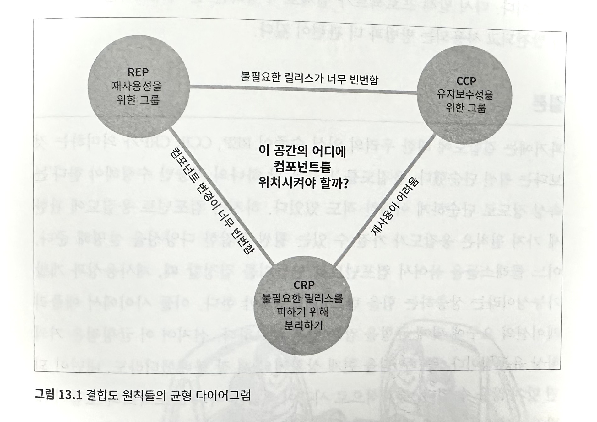

# 13. 컴포넌트 응집도
어떤 클래스를 어느 컴포넌트에 포함시켜야할지 결정해야할 때 다음의 컴포넌트 응집도와 관련된 원칙의 도움을 받도록 한다.

## REP: 재사용/릴리스 등가 원칙
재사용 단위는 릴리스 단위와 같다.

재사용/릴리스 등가 원칙은 너무 당연해 보인다. 소프트웨어 컴포넌트가 릴리스 절차를 통해 추적관리 되지 않거나 릴리스 번호가 부여되지 않는다면 해당 컴포넌트를 재사용하고 싶어도 할 수 없고, 하지도 않을 것이다.

단일 컴포넌트는 응집성 높은 클래스와 모듈들로 구성되어야 한다. 컴포넌트를 구성하는 모든 모듈은 서로 공유하는 중요한 테마나 목적이 있어야 한다. 그리고 하나의 컴포넌트로 묶인 클래스와 모듈은 반드시 함께 릴리스할 수 있어야 한다.

## CCP: 공통 폐쇄 원칙
동일 시점에 변경되는 클래스를 같은 컴포넌트로 묶고, 서로 다른 시점에 다른 이유로 변경되는 클래스는 다른 컴포넌트로 분리하라 (단일책임원칙)

단일 클래스는 변경의 이유가 여러개 있어서는 안 된다고 말하듯, 단일 컴포넌트는 변경의 이유가 여러 개 있어서는 안 된다. 대다수의 애플리케이션에서 `유지보수성은 재사용성보다 훨씬 중요하다.`

CCP는 변경될 가능성이 있는 클래스는 모두 한곳으로 묶을 것을 권한다. 물리적, 개념적으로 강하게 결합되어 항상 함께 변경되는 클래스들은 하나의 컴포넌트에 속해야 한다. 발생할 가능성이 있거나 과거에 발생했던 대다수의 공통적인 변경에 대해서 클래스가 닫혀있도록 설계한다.

## CRP: 공통 재사용 원칙
공통 재사용 원칙도 클래스와 모듈을 어느 컴포넌트에 위치시킬지 결정할 때 도움되는 원칙이다. CRP에서는 같이 재사용되는 경향이 있는 클래스와 모듈들은 같은 컴포넌트에 포함해야 한다고 말한다.

CRP는 각 컴포넌트에 어떤 클래스들을 포함시켜야 하는지를 설명하고, 반대로 동일한 컴포넌트로 묶어서는 안되는 클래스가 무엇인지도 말해준다. 

CRP는 인터페이스 분리 원칙(ISP)의 포괄적인 버전이다. ISP는 사용하지 않는 메서드가 있는 클래스에 의존하지 말라고 조언한다. CRP는 사용하지 않는 클래스를 가진 컴포넌트에 의존하지 말라고 조언한다.

## 컴포넌트 응집도에 대한 균형 다이어그

응집도에 관한 세 원칙은 서로 상충된다. REP와 CCP는 포함 원칙으로 컴포넌트를 더욱 크게 만든다. CRP는 배제 원칙이며 컴포넌트를 더욱 작게 만든다.

REP와 CRP에만 중점을 두게 되면, 사소한 변경이 생겼을 때 너무 많은 컴포넌트에 영향을 미친다. 반대로 CCP와 REP에만 과도라게 집중하면 불필요한 릴리스가 너무 빈번해진다.

주로 프로젝트 초기에는 CCP가 REP보다 훨씬 더 중요하다. 이는 개발 가능성이 재사용성보다 더욱 중요하기 때문이다. 프로젝트의 컴포넌트 구조는 시간과 성숙도에 따라 변한다.