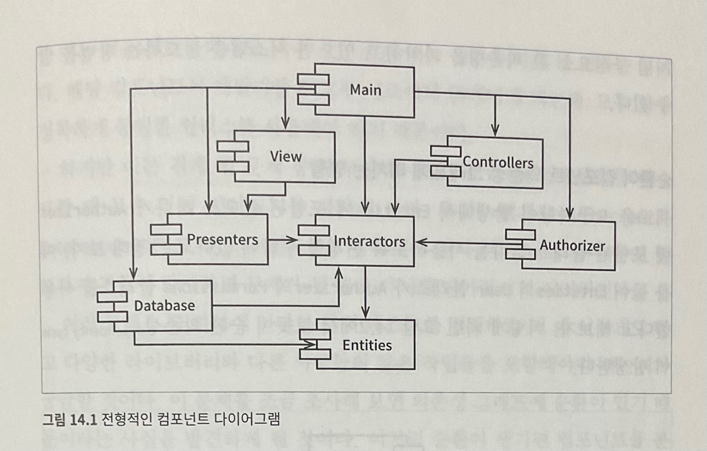

# 14. 컴포넌트 결합
## ADP: 의존성 비순환 원칙
`컴포넌트 의존성 그래프에 순환이 있어서는 안 된다.`

많은 개발자가 동일한 소스 파일을 수정하는 환경에서는 타인에 의해 잘 돌아가던 코드가 동작하지 않게 되는 경우가 많이 발생한다. 이러한 문제의 해결책으로는 1)주단위 빌드, 2)의존성 비순환 원칙 이 있다.

### 주 단위 빌드
모든 개발자는 일주일의 첫 4일 동안은 서로 신경쓰지 않고 작업을 한다. 그후 금요일이 되면 경경된 코드를 모두 통합하여 시스템을 빌드한다.

프로젝트 규모가 커지게 되면 프로젝트 통합은 하루만에 끝나는게 불가능해진다. 개발보다 통합에 드는 시간이 점점 늘어나게 되면서 팀의 효율성도 서서히 나빠지게 된다.

### 순환 의존성 제거하기
개발 환경을 릴리스 가능한 컴포넌트 단위로 분리한다. 컴포넌트는 개별 개발자 또는 단일 개발팀이 책임질 수 있는 작업 단위가 된다. 개발자는 해당 컴포넌트가 동작하도록 만든 후, 해당 컴포넌트를 릴리스하여 다른 개발자가 사용할 수 있도록 만든다. 개발자는 자신만의 공간에서 해당 컴포넌트를 지속적으로 수정하고, 나머지 개발자는 릴리스된 버전을 사용한다.

컴포넌트가 새로 릴리스되어 사용할 수 있게 되면, 다른 팀에서는 새 릴리스를 당장 적용할지를 결정해야 한다. 즉 어떤 팀도 다른 팀에 의해 좌주되지 않는다. 특정 컴포넌트가 변경되더라도 다른 팀에 즉각 영향을 주지는 않는다. 

이 절차가 성공적으로 동작하려면 컴포넌트 사이의 의존성 구조를 반드시 관리해야 한다. `의존성 순환이 있어서는 안 된다.`

위 다이어그램을 주목해보자. 어느 컴포넌트에서 시작하더라도 의존성 관계를 따라가면서 최초의 컴포넌트로 되돌아갈 수 없다. 즉 이 구조에서는 순환이 없다. Presenters를 담당하는 팀에서 새로운 리릴스를 만들면 이 릴리스에 영향을 받는 컴포넌트는 View, Main 컴포넌트이다. 이 컴포넌트를 작업중인 개발자는 Presenters의 새로운 릴리스와 자신의 작업물을 언제 통합할지를 반드시 결정해야 한다.

시스템 전체를 릴리스해야 할 때가 오면 릴리스 절차는 상향식으로 진행된다. 먼저 Entities 컴포넌트를 컴파일하고, 테스트하고, 릴리스한다. 그리고 Database, Interactors에 대해서 동일한 과정을 거치고 Presenters, View, Controller, Authorizer 순으로 진행한다.

### 순환이 컴포넌트 의존성 그래프에 미치는 영향
순환은 즉각적인 문제를 일으킨다. 순환 관계의 있는 컴포넌트는 하나의 거대한 컴포넌트가 되어 버린다. 결국 이들 컴포넌트 중 어느 것을 개발하더라도 서로에게 얽매이게 되어 모두 항상 정확하게 동일한 릴리스를 사용해야 한다.

순환이 생기면 컴포넌트를 분리하기 상당히 어려워지고, 단위 테스트를 하고 릴리스를 하는 일도 굉장히 어려워지며 에러도 쉽게 발생한다. 

### 순환 끊기
컴포넌트 사이의 순환을 끊고 의존성을 다시 원상복구 하는 일은 언제라도 가능하다.
1. 의존성 역전 원칙을 적용한다. -> 중간에 인터페이스를 생성하여 서로 인터페이스를 바라보게 하면 순환을 끊을 수 있다.

2. 순환 관계였는 컴포넌트가 모두 의존하는 새로운 컴포넌트를 만들어서 그 컴포넌트를 의존하게 한다.

### 흐트러짐
요구사항이 변경되면 컴포넌트 구조도 변경될 수 있다. 애플리케이션이 성장함에 따라 컴포넌트 의존성 구조는 서서히 흐트러지며 또 성장한다. 따라서 의존성 구조에 순환이 발생하는지를 항상 관찰해야 한다.

## 하향식 설계

## SDP: 안정된 의존성 원칙

## SAP: 안정된 추상화 원칙

## 결론ㅇ
