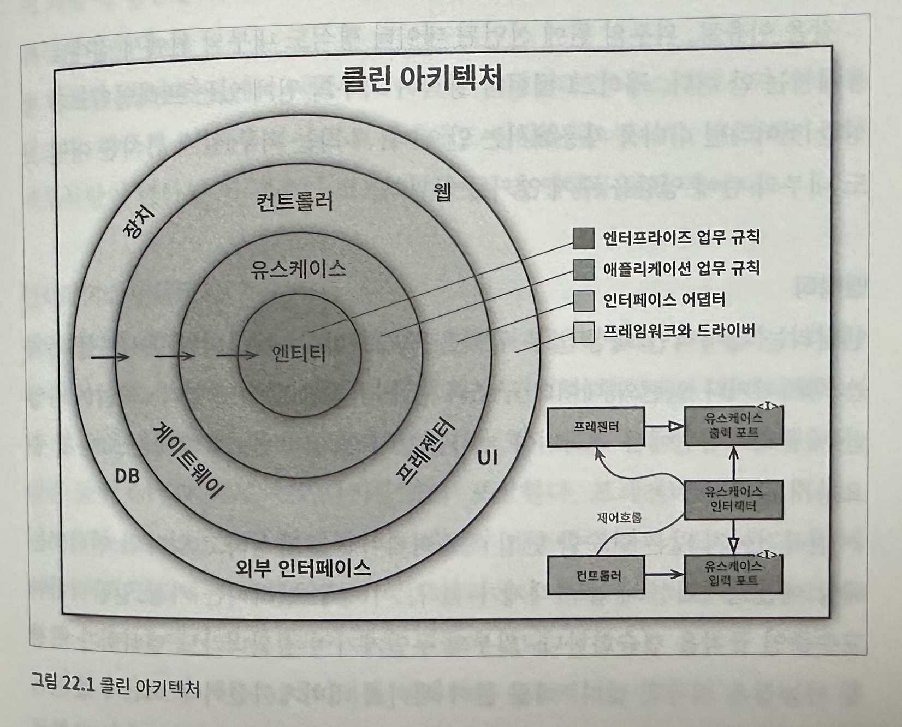

# 22. 클린 아키텍처
시스템 아키텍처와 관련된 여러 가지 아이디어가 있다.
* 육각형 아키텍처
* DCI
* BCE

이들 아키텍처는 세부적으로는 차이가 있더라도 그 내용은 상당히 비슷하다. 이들의 목표는 바로 `관심사의 분리다.` 이들은 모두 소프트웨어를 계층으로 분리함으로써 관심사의 분리라는 목표를 달성할 수 있었다. 이들 아키텍처는 모두 시스템이 다음과 같은 특징을 지니도록 만든다.
1. 프레임워크 독립성 - 아키텍처는 프레임워크의 존재 여부에 의존하지 않는다. 즉 프레임워크가 지닌 제약사항안으로 시스템을 욱여 넣도록 강제하지 않는다.
2. 테스트 용이성 - 업무 규칙은 UI, 데이터베이스, 웹 서버 등이 없이도 테스트할 수 있다.
3. UI 독립성 - 시스템의 나머지 부분을 변경하지 않고도 UI를 쉽게 변경할 수 있다.
4. 데이터베이스 독립성 - 업무 규칙은 데이터베이스에 결합되지 않는다.
5. 모든 외부 에이전시에 대한 독립성 - 실제 업무 규칙은 외부 세계와의 인터페이스에 대해 알지 못한다.

## 의존성 규칙
위 그림에서는 소프트웨어의 서로 다른 영역을 표현한다. 보통 안으로 들어갈수록 고수준의 소프트웨어가 된다. 바깥원은 매커니즘이고, 안쪽 원은 정책이다. 이러한 아키텍처가 동작하도록 하는 가장 중요한 규칙은 `의존성 규칙`이다. `소스코드의 의존성은 반드시 안쪽으로, 고수준 정책을 향해야 한다.`

내부의 원에 속한 코드는 외부의 원에 선언된 어떤 것에 대해서도 그 이름을 언급해서는 안된다. 외부의 원에 선언된 데이터 형식도 내부의 원에서 절대로 사용해서는 안 된다.

### 엔티티
엔티티는 전사적인 핵심 업무 규칙을 캡슐화한다. 외부에서 무언가가 변경되더라도 엔티티가 변경될 가능성은 지극히 낮다. 운영 관점에서 특정 애플리케이션에 문언가 변경이 필요하더라도 엔티티 계층에는 절대로 영향을 주어서는 안 된다.

### 유스케이스
유스케이스 계층의 소프트웨어는 애플리케이션에 특화된 업무 규칙을 포함한다.  또 유스케이스 계층의 소프트웨어는 시스템의 모든 유스케이스를 캡슐화하고, 구현한다. 유스케이스는 엔티티로 들어오고 나가는 데이터 흐름을 조정하며, 엔티티가 자신의 핵심 업무 규칙을 사용해서 유스케이스의 목적을 달성하도록 이끈다.

유스케이스는 여러 관심사로부터 격리되어 있기 때문에 외부에서 영향을 받아서도, 엔티티로 영향을 줘서도 안 된다.

### 인터페이스 어댑터
어댑터는 데이터를 유스케이스와 엔티티에게 가장 편리한 형식에서 데이터베이스나 웹 같은 외부 에이전시에게 가장 편리한 형식으로 변환한다. 예)프레젠터, 뷰, 컨트롤러는 모두 인터페이스 어댑터 계층에 속한다.

이 계층안에 속한 어떤 코드도 데이터베이스에 대해 조금도 알아서는 안 된다. 

### 프레임워크와 드라이버
가장 바깥쪽 계층은 일반적으로 데이터베이스나 웹 프레임워크 같은 프레임워크나 도구들로 구성된다. 프레임워크나 드라이버 계층은 모든 세부사항이 위치하는 곳이다. 이러한 것들은 모두 외부에 위치시켜 피해를 최소화한다.

### 경계 횡단하기
제어흐름과 의존성의 방향이 명백히 반대여야 하는 경우, 대체로 의존성 역전 원칙을 사용하여 해결한다. 예) 자바에서 인터페이스와 상속 관계를 사용

### 경계를 횡단하는 데이터는 어떤 모습인가
경계를 가로지르는 데이터는 흔히 간단한 데이터 구조로 이루어져 있다. 기본적인 구조체나 간단한 데이터 전송 객체 등 원하는 대로 고를 수 있다. 
