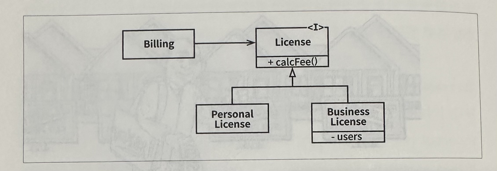

# 9. LSP : 리스코프 치환 원칙
### 상속을 사용하도록 가이드하기

위 그림에서 License는 두 가지의 하위 타입을 가지고 있고, 이 하위 타입은 서로 다른 알고리즘을 이용해서 동작한다. Billing 애플리케이션의 행위가 License 하위 타입 중 무엇을 사용하는지에 전혀 의존하지 않기 때문에 이 설계는 LSP를 준수한다.

### 정사각형/직사각형 문제
83p

### LSP와 아키텍처
초창기에는 LSP는 상속을 사용하도록 가이드하는 방법 정도로 간주되었다. 시간이 지나면서 LSP는 인터페이스와 구현체에도 적용되는 더 광범위한 소프트웨어 설계 원칙으로 변모해왔다.

### LSP 위배 사례
84~86p