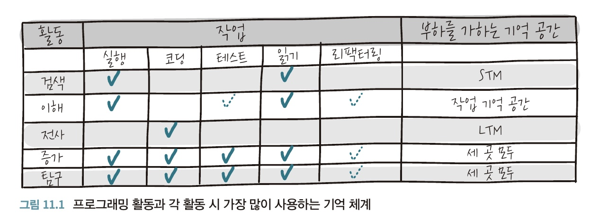

# 11. 코드를 작성하는 행위
## 11.1 프로그래밍 중 이루어지는 다양한 활동
프로그램 작성 중 여러가지 종류의 활동이 일어나는 이러한 여러 활동은 __인지적 차원 표기법(CDN)__ 이라는 프레임워크로 처음 고안되었다.

1. 검색 : 코드베이스를 살펴보고 특정 정보를 검색하는 작업이다. 검색은 STM에 무리를 가한다. 검색대상, 이미 탐색한 코드의 경로 및 이유 등 기억해야할 사항이 생기게 된다. 이런 활동시 기억의 부하를 줄이기 위해 종이나 별도의 문서에 노트를 작성하면 도움이된다. 또는 특정 코드를 살펴본 이유를 주석문으로 작성해 놓는것도 도움이 된다.
2. 이해 : 활동을 수행할 코드를 읽고 실행해봄으로써 그 기능을 이해하게 된다. 이해는 작업 기억 공간에 부담을 주는 활동이기 때문에 코드를 이해하기 쉽게 리팩터링하는 것이 도움이 된다. 이해 활동을 위한 좋은 전략은 작업 기억 공간을 지원하는 것이다. 코드에 대한 모델을 만들어보고 새로운 정보를 인출할 때마다 그 모델을 갱신해보자.
3. 전사 : 전사는 단순히 코딩하는 활동이다. 구현하려면 문법 구조를 떠올릴 수 있어야 하기 때문에 LTM에 부하를 유발한다.
4. 증가 : 검색, 이해, 전사가 합쳐진 활동이다. 예) 새기능 추가, 여러 활동을 동반하기 때문에 3가지 기억 체계에 모두 부하를 초래할 수 있다.
5. 탐구 : 탐구 활동의 본질은 코드를 사용하여 스케치하는 것과 같다. 탐구 활동시 테스트 실행, 기존 코드 읽기, 새 계획에 맞게 코드를 리팩터링하기 등 여러 가지 프로그래밍 관련 작업을 연속적으로 수행하게 된다. 탐구 활동도 다른 활동에 의존하기 때문에 3가지 기억 공간에 모두 어려움을 겪는다.
6. 디버깅은 어떤가? 디버깅할 때는 종종 5가지 활동을 모두 수행한다.

## 11.2 프로그래머의 업무 중단
개발자의 업무 시간의 약 20%가 업무 중단에 쓰인다. 마이크로소프트의 연구에 따르면 업무가 중단 됐다가 원래 하던 업무로 되돌아가는 것이 심각한 문제라고 생각하는 개발자가 62%나 되는 것으로 나타났다.

1. 프로그래밍 작업에는 워밍업이 필요하다 : 참가자들에게 c로 작성된 알고리즘의 두 가지 버전을 읽게 하는 실험을 했다. 10명중 9명은 과제 중 인지 부하의 변동이 컸고, 과제에서 소요된 시간을 보니 업무 중간의 인지 부하가 가장 높은 것으로 나타났다. 이 연구의 결과를 통해 과제에서 일종의 워밍업 및 냉각 단계가 있고 그 중간에 가장 힘든 작업이 수행된다는 것을 시사했다.
2. 중단 후에는 어떻게 되는가? : 업무 중단이 발생하면 당연히 생산성에 상당한 지장을 초래한다. 업무 중단후 업무를 다시 시작하는 데 약 25분이 소요됐다. 
3. 중단에 잘 대비하는 방법 : 다음은 중단에 대처하는 데 도움이 되는 세 가지 방법이다.
   * 정신 모델 저장 : 정신 모델에 대한 메모를 주석문으로 남기는 것도 도움이 된다. 일부 개발자들은 주석문을 광범위하게 사용하는 것을 바람직하지 않다고 생각하는데 코드는 프로그래머의 사고 과정을 거의 설명하지 못하므로 대부분 작성자의 정신 모델을 적절하게 표현하지 못한다. 코드에 특정 접근 방식을 선택한 이유, 코드의 목표 또는 구현을 위해 고려한 다른 대안 같은 내용을 문서화 해놓으면 다른 사람이 코드를 읽을 때 매우 유용할 뿐 아니라 자기 자신의 정신 모델을 일시적으로 저장하는 데도 도움이 된다.
   * 미래 기억 향상 : 미래 기억은 미래에 무언가를 할 것에 대한 기억이다. 이러한 유형의 기억은 계획 및 문제 해결과 밀접한 관련이 있다. 미래 기억을 잊지 않기 위해 사용하는 방법으로 주석문으로 to-do를 적거나, 책상위에 스티커 메모, 자신에게 이메일 보내기 등등이 있다.
   * 하위 목표 라벨 붙이기 : 이 방법은 문제를 어떤 작은 단계로 나눌 수 있는지 명시적으로 기록한다. 이렇게 하면 코드의 작은 부분을 채울 수 있고, 실패시 대처할 계획을 항상 가질 수 있다.
4. 프로그래머를 방해할 때 : 이중 과제 실험을 통해 작업 중에 방해로 인하여 작업이 중단된 그룹이 그렇지 않은 그룹보다 작업을 끝마칠 때까지 시간이 더 오래 걸렸고, 중단이 있던 작업이 그렇지 않은 작업보다 마치기 더 어렵다고 인식했다. 주요 과제가 중단된 참가자들은 더 많은 불안감을 경험했고, 중단된 사람들이 두 배나 더 많은 실수를 한다는 것을 밝혀냈다.
5. 멀티태스킹에 대한 고찰 : 사람들은 깊은 인지 작업을 하는 동안 여러 가지 일을 할 수 없다. 정보를 저장하는 세 단계 (인지, 연상, 자율)에서 자율 단계에 도달하지 않은 경우 두 개 이상의 작업을 동시에 수행할 수 없다. ex) 한국어로 쓰인 책을 읽기 위해 무언가 더 배울필요가 없어 뜨개질과 같은 자동화된 다른 일과 동시에 할 수 있다. 