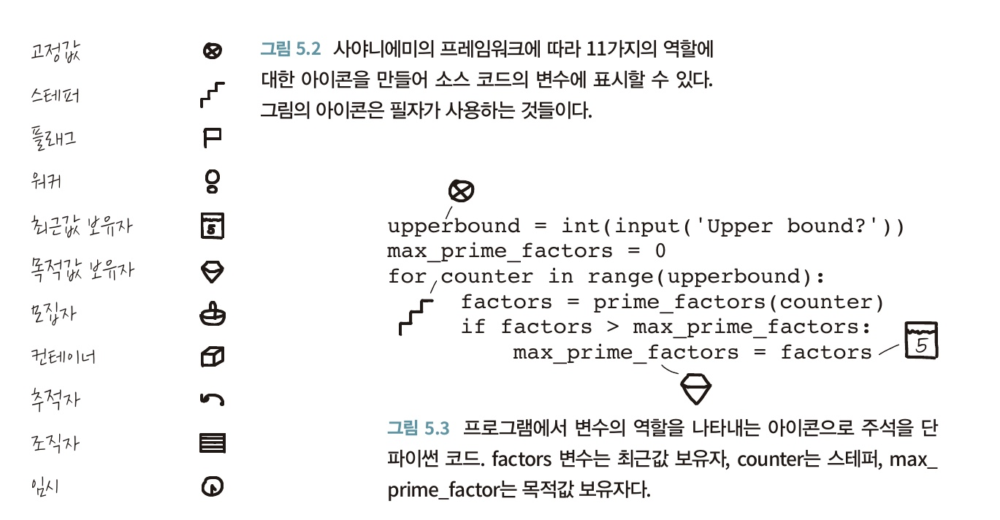

# 5. 코드를 더 깊이 있게 이해하기
코드가 하는 일이 무엇인지 이해하고 나면, 다음 단계는 코드에 대해 좀 더 깊이 생각하는 것이다.

## 5.1 '변수 역할' 프레임워크
코드에 대해 추론할 때 변수가 중심적인 역할을 한다. 변수가 어떤 종류의 정보를 담고 있는지 이해하는 것은 코드를 추론하고 수정하는 데 결정적인 역할을 한다. 적절한 변수명은 표식으로 사용될 수 있고, 읽고 있는 코드를 깊이 이해하는 데도 도움이 된다.

1. 변수는 각자 다른 일을 한다.
2. 11가지 역할
    * 고정 값 : 초기화를 통해 값이 할당된 이후 값이 변경되지 않는 변수
    * 스테퍼 : 루프를 반복 실행하며 값이 단계적으로 변하는 변수가 스테퍼의 역할을 한다.
    * 플래그 : 무엇인가 발생했거나 어떤 경우에 해당하는지를 나타내는 변수
    * 워커 : 스테퍼와 유사하게 자료구조를 순회한다. 다른 점은 워커는 일단 루프가 시작되기 전에는 어떤 값을 가지게 될지 알 수 없다.
    * 최근값 보유자 : 어떤 값이 변해갈 때 가장 최근에 변경된 값을 갖는 변수
    * 목적값 보유자 : 어떤 값에 대해 반복할 때는 그 목적이 어떤 특정한 값을 찾는 것일 수 있다. 찾고자 하는 조건에 부합하는 값을 갖는 변수를 목적값 보유자라고 한다.
    * 모집자 : 데이터를 모으거나 모은 데이터에 대해 어떤 연산을 수행하여 얻은 값을 저장하는 변수
    * 컨테이너 : 값을 새로 추가하거나 삭제할 수 있는 자료구조라면 컨테이너 변수다
    * 추적자 : 이전 값 혹은 다음 값을 추적해야할 필요가 있는 경우 사용, 항상 다른 변수에 연관되어 있다
    * 조직자 : 다른 값을 저장하기 위한 목적으로 사용하는 변수
    * 임시 : 잠시만 사용하기 위한 변수

## 5.2 역할과 패러다임
역할은 특정한 프로그래밍 패러다임에만 제한되지 않고 모든 패러다임에 나타난다.

### 역할의 이점
사야니에미의 프레임워크는 변수에 대해 논의할 때 사용할 수 있는 새로운 용어를 제공해주는 개념이다. 연구에 의하면 이 프레임워크는 학생들이 소스 코드를 머릿속으로 처리하는 데 도움이 될 뿐 아니라 변수 역할 프레임워크를 사용하는 학생이 그렇지 않은 학생보다 겅과가 더 뛰어난 것으로 알려져 있다. 이 프레임워크가 매우 효과적인 이유는 몇개의 역할이 하나로 묶여서 프로그램의 어떤 한 타입을 특징짓는 다는 것이다.

TIP) 완전히 생소한 코드를 파악할 때 코드를 프린트하거나 PDF로 저장해서 코드에 주석을 달면 도움이 된다. 각 변수를 역할에 따라 작은 아이콘으로 표시하면 좋다.

### 헝가리안 표기법
헝가리안 표기법은 변수의 타입을 변수명에 나타내는 방식이다. 변수의 이름이 길어지므로 코드를 읽는데 어려움을 유발할 수 있다. 또 변수 타입 변경시 많은 변수에 영향을 미칠 수 있다. 따라서 헝가리안 표기법은 타입이 있는 프로그래밍 언어에서는 그다지 유용하지 않다.

## 5.3 프로그램에 대해 깊이 있는 지식을 얻으려면

### 텍스트 지식 대 계획 지식
프로그래머가 소스 코드를 이해하는 두 개의 서로 다른 층위에 대한 모델로 '텍스트 구조 지식', '계획 지식'이 있다.

텍스트 구조 지식은 키워드가 하는 일이나 변수의 역할 같은 프로그램의 표면적인 이해와 관련되어 있다. 계획 지식은 프로그래머가 프로그램을 작성할 때 계획한 것이 무엇인지 혹은 무엇을 달성하려고 했는지를 나타낸다.

코드를 작성한 프로그래머의 목적은 변수의 역할을 통해서만이 아니라 코드가 어떤 구조로 되어 있고, 어떻게 연결되어 있는지 살펴볼 때 명확해진다.

### 프로그램 이해의 여러 단계
프로그램에 대한 계획 지식을 갖는다는 것은 코드의 각 부분이 다른 부분들과 어떤 방식으로 관련 되어 있는지 이해하는 것을 의미한다.

표면적 지식으로부터 깊은 이해로의 진행은 다음과 같은 단계를 거친다.
1. 초점을 찾는다. -> 코드를 읽을 때 중요한 개념이다. 어디서부터 읽기 시작해야 할지 알아야 한다.
2. 초점으로부터 지식을 확장한다. -> 코드에 존재하는 관계를 찾아보라
3. 관련된 개체로부터 개념을 이해한다.
4. 여러 개체에 걸쳐있는 개념을 이해한다.

이전 장에서 살펴봤던 복잡한 코드를 읽을 때 인지 부하를 줄이기 위한 방법
1. 모든 변수를 원으로 표시한다.
2. 비슷한 변수들을 연결한다.
3. 모든 메서드나 함수 호출을 원으로 표시한다.
4. 메서드나 함수 호출을 정의와 연결한다.
5. 클래스의 모든 인스턴스를 원으로 표시한다.
6. 클래스와 그 클래스의 인스턴스를 연결한다.

## 5.4 텍스트를 읽는 것과 코드를 읽는 것은 유사하다
프로그래머는 평균적으로 자신의 업무 시간의 60%를 코드 작성이 아닌 읽는 것에 할애하는 것으로 추정된다. 

하지만 많은 개발자들은 코드를 한줄 한줄 또는 디버거를 걸어 코드를 라인 단위로 실행시키곤 하는데 이런 방식은 시간을 많이 소모한다. 그래서 기존 코드를 파악해서 재사용하거나 수정하기 보다는 자신이 코드를 처음부터 다시 작성하는 것을 선호하는 상황으로 이어진다.

이번 장에서는 코드를 읽는 것과 인간의 글을 읽는 것이 어떻게 유사한지 살펴보고 텍스트를 읽는 기법 중에서 코드 읽기에도 적용해 볼 수 있는 것들을 소개한다. 

### 코드를 읽을때 우리 뇌에서는 무슨 일이 일어나는가?
1. 브로드만 영역 : 브로드만 영역은 두뇌의 서로 다른 52개의 영역을 나타낸다. 연구를 통해 인지 기능이 두뇌의 어느 영역에 자리잡고 있는지 상당히 많이 알려졌다. 
2. 코드가 두뇌에서 하는 일에 대한 fMRI 근거 : 프로그래밍에 대해서도 fMRI를 통해 연구를 수행했는데 알고리즘을 구현한 자바 코드를 읽고 뇌에 어느 부분이 활성화 되는지 보았다. 그 결과 브로드만 영역에서 작업 기억 공간과 주의를 기울이는 정신 활동과 관련 있는 부분이 활성화 되었고, 인간 언어 이해와 관련있는 부분도 활성화 되었다. 

### 프랑스어를 배울 수 있다면 파이썬도 배울 수 있다
코드 아카데미에서 파이썬 수업을 들은 학생 36명에 대해 프로그래밍 능력과 수학, 언어, 추론등의 영역에서 능력을 평가하였다. 연구 결과 수학적 능력을 적용해야 하는 지식과 기술은 2%로 프로그래밍 능력에 대한 예측력이 가장 작았다. 언어 능력은 17%로 나왔고 `가장 뛰어난 예측력을 보인 요인은 34%로 작업 기억 공간 용량과 추론 능력이였다.` 

코드 아카데미의 수업을 얼마나 빨리 마쳤는지에 대한 학습률은 언어 능력이 가장 큰 요인이였다. 읽기 능력이 뛰어난 학생이 일반적으로 학습 성과가 좋고 반대인 경우 빠르고 쉽게 학습하지 못한다는 사실이 근원적 요인일 수 있다.

## 5.5 코드 읽기에 적용해볼 수 있는 텍스트 이해 전략
텍스트를 읽을 때 사람들이 흔히 사용하는 방법은 여러 가지가 있다. 신문 기사를 예를 들면 1)기사를 자세히 읽기 전에 쭉 훑어본다, 2)텍스트의 맥락을 잘 이해하기 위해 텍스트에 실린 그림만 본다, 3)읽고 있는 것을 요약하거나 가장 중요한 부분을 하이라이트한다는지 할 수 있다.

사람들이 시각을 통해 무엇을 보는지 이해하고자 할 때 __시각 추적기__ 가 사용된다. 시각 추적기는 스크린이나 페이지에서 주의를 집중하는 위치를 알아내는 데 사용하는 장치다. 연구를 통해 프로그래머들이 코드를 전체적으로 파악하기 위해 먼저 코드를 스캔한다는 것을 발견했다. 이런 유형의 빠른 스캔은 자연어로 된 텍스트의 구조를 전체적으로 파악할 때 흔히 일어나며 코드를 읽을때도 이런 방식을 적용하는 것으로 보인다.

초급 프로그래머와 숙련된 프로그래머를 대상으로 연구를 해 두 집단의 코드를 읽는 방식과 자연어로 된 텍스트를 읽는 방식을 비교했다. 초급 프로그래머는 텍스트를 읽을 때 시야의 움직임의 약 80%는 순차적이고 코드를 읽을 땐 75% 정도가 순차적이었다. 순차적이지 않는 25%는 함수의 콜 스택 흐름을 좇아갔다.
(콜 스택을 좇아 코드를 읽는 법은 경험을 쌓아가면서 배우게 되는 것이다.)

## 5.5 코드를 읽기에 적용해볼 수 있는 텍스트 이해 전략
텍스트 이해에 대한 전략은 다음의 7가지 범주로 나뉜다. 코드 이해 관점에서 텍스트 이해를 위한 7가지 전략을 보자
1. 기존 지식의 활성화 : 대부분 코드를 읽을 때 자세히 읽기 전에 먼저 스캔을 한다. 스캔을 통해 코드 내에 존재하는 개념과 문법적 요소들에 대한 일차적 이해가 가능해진다. 
2. 모니터링 : 코드를 읽을 땐 무엇을 읽고 있는지, 이해는 하고 있는지를 계속 추적하는 것이 중요하다. (이해되지 않는 것도 머릿속에서 기억하고 있어야 한다.)
3. 코드에서 중요한 라인 결정하기 : 어떤 라인이 중요한지 파악하는 것은 연습을 통해 할 수 있다. 얼마나 많은 라인을 차지하는지는 중요하지 않다. 프로그램이 실행될 때 코드의 어느 부분이 가장 중요한 영향을 끼치는지에 대해 생각해보는 것이다.
4. 변수명의 의미를 추론하기 : 변수 이름은 중요한 표식이다. 코드가 하는 일에 대한 힌트를 제공하는 기능을 한다. 따라서 코드를 읽을 때 의식적으로 변수에 주목하면 좋다. (예. 코드를 따라가면서 모든 식별자의 이름을 나열해본다)
5. 시각화 : 상태표 작성, 연산 테이블 작성
6. 질문하기 : 스스로에게 질문하는 것이 코드의 목적과 기능에 대해 이해하는 데 도움이 된다.
7. 코드 요약 : 코드를 우리가 사용하는 언어로 요약하는 것은 코드가 하는 일을 깊이 이해하는 데 도움이 된다.